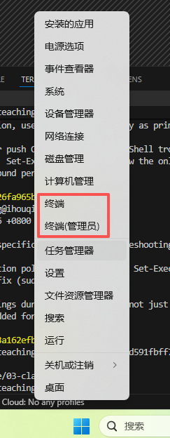
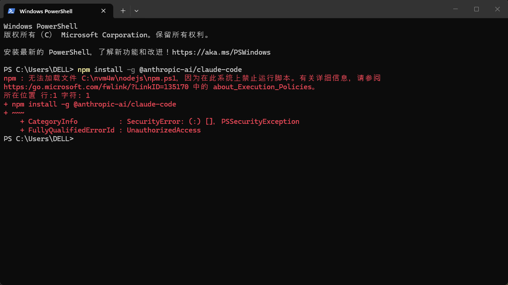

# 📥 安装 Claude Code

> 在你的电脑上安装 Claude Code，准备开始 AI 编程之旅！

---

## 🎯 目标

完成这一步后，你将拥有：
- ✅ 安装好的 Claude Code

---

## 📋 前置条件

安装 Claude Code 之前，你需要先安装 **Node.js**（版本 18 或更高）。

👉 **[安装 Node.js 教程](../00-introduction/install-nodejs.md)** — 如果你还没安装 Node.js，先去看这个教程！

---

## 🚀 安装 Claude Code

### Windows 系统

#### Step 1：打开终端

**Windows 10 / 11 推荐方式**：右键点击 **「开始」** 按钮（或按 `Win + X`），在弹出的菜单中选择 **「终端」** 或 **「PowerShell」**。



> 💡 如果右键菜单里有 **「终端（管理员）」**，也可以选这个。管理员权限可以避免一些安装问题。

> ⚠️ 如果打开后提示 **"禁止运行脚本"**，请看下方的问题排查章节，改一个设置就好了！

#### Step 2：安装 Claude Code

在终端中输入以下命令：

```bash
npm install -g @anthropic-ai/claude-code
```

> 💡 `npm` 是 Node.js 的包管理器，就像应用商店一样。这个命令是从"应用商店"下载安装 Claude Code。

#### Step 3：验证安装

```bash
claude --version
```

如果显示版本号，说明安装成功！🎉

---

### macOS 系统

#### Step 1：打开终端

按 `Command + 空格`，搜索"Terminal"，打开。

#### Step 2：安装 Claude Code

```bash
npm install -g @anthropic-ai/claude-code
```

> ⚠️ 如果看到 `EACCES: permission denied` 错误，说明权限不够。在命令前面加 `sudo` 即可：
>
> ```bash
> sudo npm install -g @anthropic-ai/claude-code
> ```
>
> 系统会提示你输入电脑密码（输入时不会显示，这是正常的），输完按回车就行。

#### Step 3：验证安装

```bash
claude --version
```

---

### Linux 系统

#### Step 1：打开终端

用快捷键 `Ctrl + Alt + T` 打开终端。

#### Step 2：安装 Claude Code

```bash
npm install -g @anthropic-ai/claude-code
```

> ⚠️ 如果看到权限错误，加 `sudo`：
>
> ```bash
> sudo npm install -g @anthropic-ai/claude-code
> ```

#### Step 3：验证安装

```bash
claude --version
```

---

<details>
<summary>🌐 备选安装方式（适合海外用户）</summary>

如果你在海外或有代理，也可以用 **官方安装脚本**（不需要 Node.js）：

**macOS / Linux：**

```bash
curl -fsSL https://claude.ai/install.sh | sh
```

**Windows PowerShell：**

```powershell
irm https://claude.ai/install.ps1 | iex
```

**macOS Homebrew：**

```bash
brew install --cask claude-code
```

> ⚠️ 国内用户注意：Anthropic 不向国内提供服务，这些官方链接在国内可能无法使用。推荐使用上面的 npm 方式。

</details>

---

## 🔑 登录（可选）

安装完成后，你有 **两种方式** 开始使用 Claude Code：

### 路径 A：用 DeepSeek 模型（⭐ 推荐给学生！）

> 💡 **没有 Claude 订阅？完全没问题！**
>
> 大多数同学不需要购买 Claude 订阅。直接配置 **DeepSeek** 模型，便宜又好用！
>
> 👉 **[配置 DeepSeek 教程](../03-deepseek-claudecode/README.md)** — 这是我们推荐的路径！

### 路径 B：登录 Claude 账号（适合已有订阅的同学）

如果你已经有 Claude 订阅，可以登录使用：

1. 在终端中输入 `claude` 启动
2. Claude Code 会自动打开浏览器，让你登录 Claude 账号
3. 登录成功后就可以使用了！🎉

登录需要以下 **任意一种** Claude 订阅：

| 订阅 | 费用 | 说明 |
|------|------|------|
| 🌟 Claude Pro | $20/月 | 最适合个人使用 |
| 🚀 Claude Max | $100/月 | 无限制使用 |
| 👥 Claude Team | 团队版 | 适合团队 |
| 🏢 Claude Enterprise | 企业版 | 适合企业 |

---

## ⚠️ 安装遇到问题？

### Windows 问题

<details>
<summary>❓ PowerShell 提示"禁止运行脚本"</summary>

**错误信息**：
```
无法加载文件 xxx.ps1，因为在此系统上禁止运行脚本。
```



**原因**：Windows PowerShell 为了安全，默认不允许运行来自网络的脚本。

**解决方法**：

1. 右键开始菜单 → 选择 **「Windows PowerShell（管理员）」** 或 **「终端（管理员）」**
2. 输入以下命令，然后按回车：
   ```powershell
   Set-ExecutionPolicy -ExecutionPolicy RemoteSigned -Scope CurrentUser -Force
   ```
3. 关闭管理员窗口，重新打开普通 PowerShell 或终端
4. 再次运行安装命令：

```bash
npm install -g @anthropic-ai/claude-code
```

> 💡 执行策略只需要改一次，以后都不会再出现这个错误了！

</details>

<details>
<summary>❓ 提示 "没有权限"</summary>

**解决方法**：右键开始菜单 → 选择 **「终端（管理员）」**，在管理员窗口中重新运行安装命令。

</details>

---

### macOS 问题

<details>
<summary>❓ 提示 "EACCES: permission denied"</summary>

**错误信息**（你的终端会显示类似这样的内容）：
```
npm ERR! code EACCES
npm ERR! syscall access
npm ERR! path /usr/local/lib/node_modules
npm ERR! errno -13
npm ERR! Error: EACCES: permission denied, access '/usr/local/lib/node_modules'
npm ERR! The operation was rejected by your operating system.
```

**原因**：macOS 系统保护 `/usr/local` 目录，普通用户不能直接写入。

**解决方法（二选一）**：

**方法一（推荐⭐）：使用 sudo**
```bash
sudo npm install -g @anthropic-ai/claude-code
```
系统会提示输入你的电脑密码（**输入时不会显示任何字符，这是正常的！**），输完按回车就行。

**方法二：修复 npm 权限（一劳永逸）**

如果不想每次都输入 `sudo`，可以修改 npm 的全局安装目录到你的用户目录：

```bash
# 1. 创建用户级的全局安装目录
mkdir ~/.npm-global

# 2. 配置 npm 使用新目录
npm config set prefix '~/.npm-global'

# 3. 把新目录加入 PATH（添加到 ~/.zshrc 或 ~/.bash_profile）
echo 'export PATH=~/.npm-global/bin:$PATH' >> ~/.zshrc
source ~/.zshrc

# 4. 现在可以不用 sudo 了！
npm install -g @anthropic-ai/claude-code
```

> 💡 方法二操作稍多，但以后装其他包也不需要 sudo。建议有时间的时候做。

</details>

---

### Linux 问题

<details>
<summary>❓ 提示权限不足</summary>

**解决方法**：
```bash
sudo npm install -g @anthropic-ai/claude-code
```
输入你的用户密码（不会显示），按回车即可。

</details>

---

### 通用问题

<details>
<summary>❓ "npm 不是内部或外部命令"</summary>

**原因**：Node.js 没有安装成功。

**解决**：
1. 重新下载 Node.js：https://nodejs.org/
2. 安装时确保勾选了 **"Add to PATH"**（一般默认勾选）
3. 安装完 **重新打开** 终端再试

</details>

<details>
<summary>❓ 安装很慢或报网络错误</summary>

**原因**：国内访问 npm 官方源可能比较慢。

**解决**：使用国内镜像源：
```bash
npm install -g @anthropic-ai/claude-code --registry=https://registry.npmmirror.com
```

</details>

<details>
<summary>❓ "claude 不是内部或外部命令"</summary>

**原因**：npm 全局安装路径没有加入 PATH。

**解决**：
1. **关闭终端，重新打开** 再试（很多时候这就解决了！）
2. 如果还不行，重启电脑
3. 检查 npm 全局路径：
   ```bash
   npm config get prefix
   ```
4. 把输出的路径加到系统的 PATH 环境变量中

</details>

<details>
<summary>❓ 登录时浏览器没有打开</summary>

**解决**：
1. 在 Claude Code 里输入 `/login` 重新触发登录
2. 如果还是不行，检查终端里显示的链接，手动复制到浏览器打开

</details>

---

## 📌 下一步

Claude Code 安装好了！接下来最重要的一步：

👉 **[⭐ 配置 Claude Code + DeepSeek](../03-deepseek-claudecode/README.md)** — 让 Claude Code 使用便宜的 DeepSeek 模型

配置完成后，再回来学习怎么使用：

👉 **[Claude Code 基础用法](./basics.md)** — 学会和 Claude Code 对话
