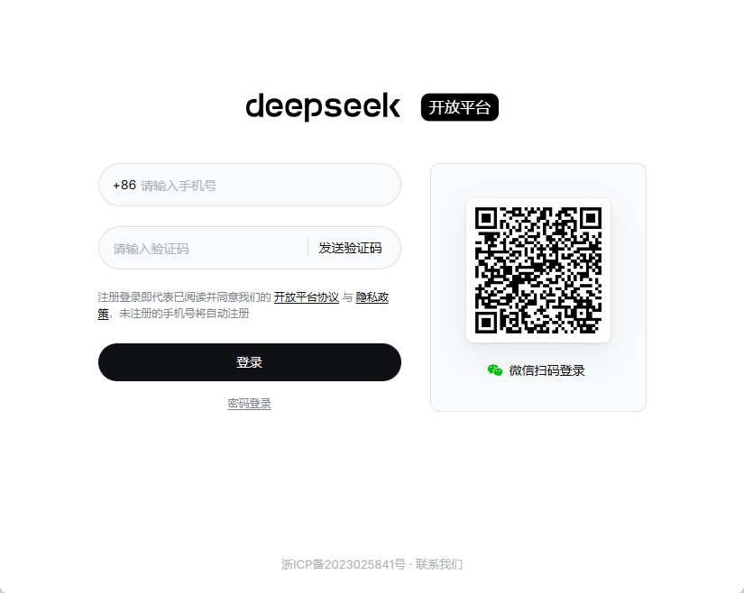
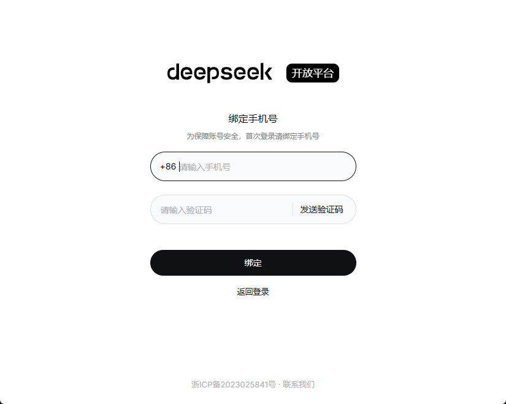
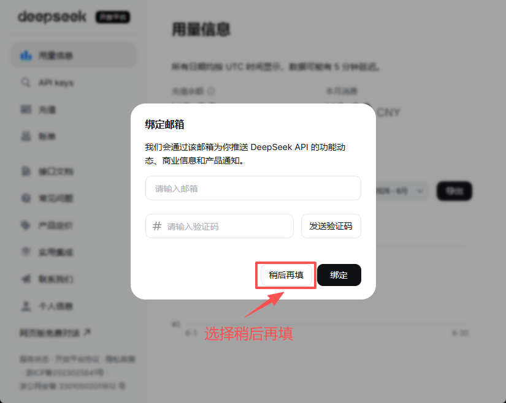
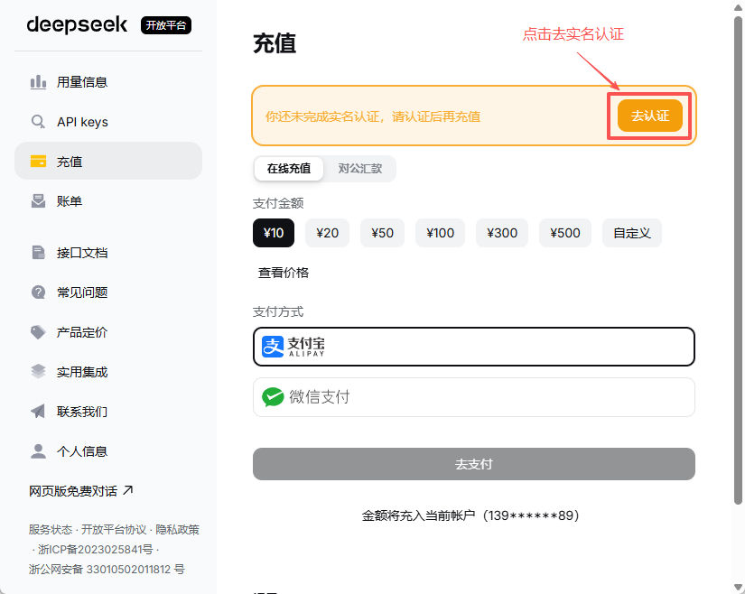
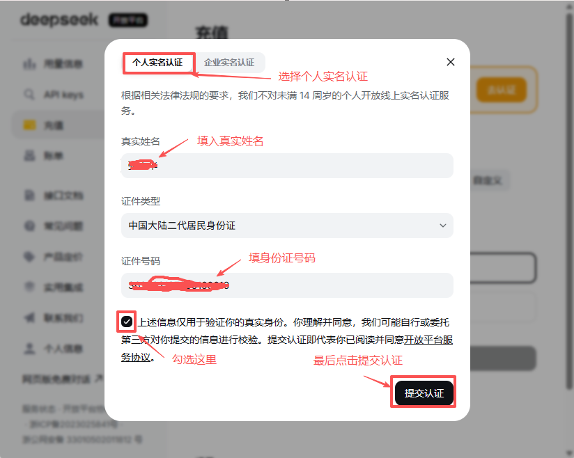
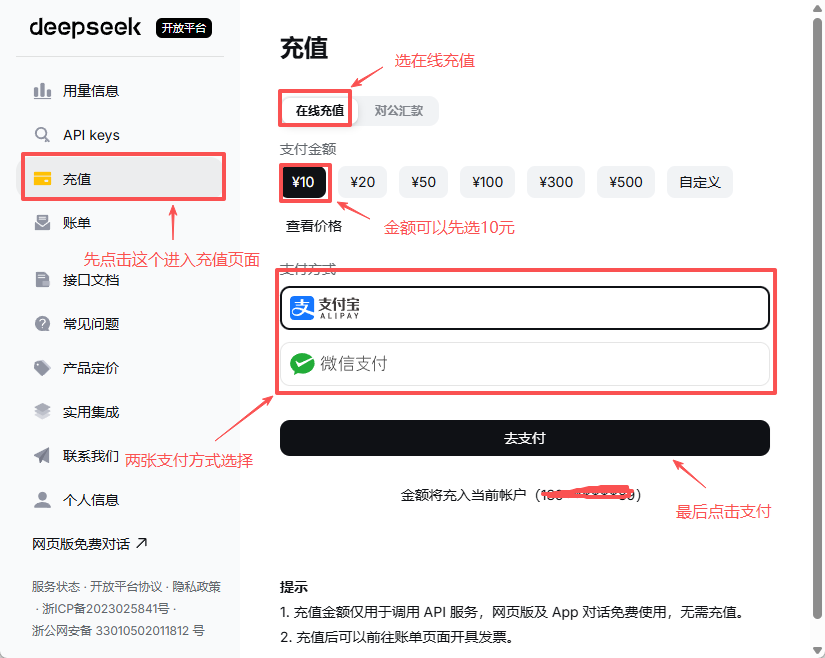
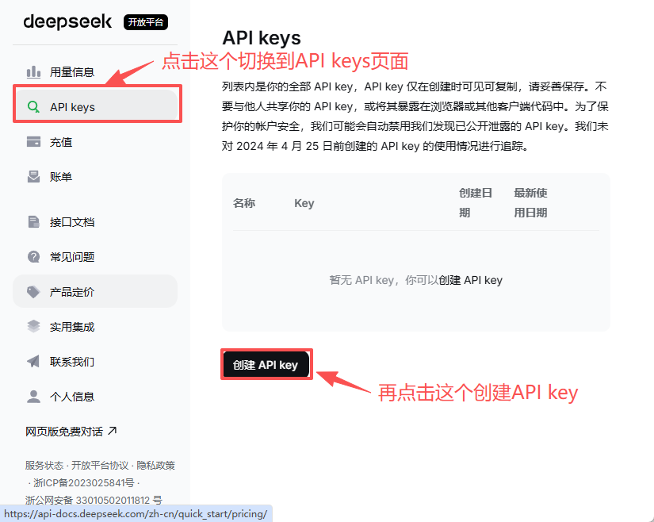
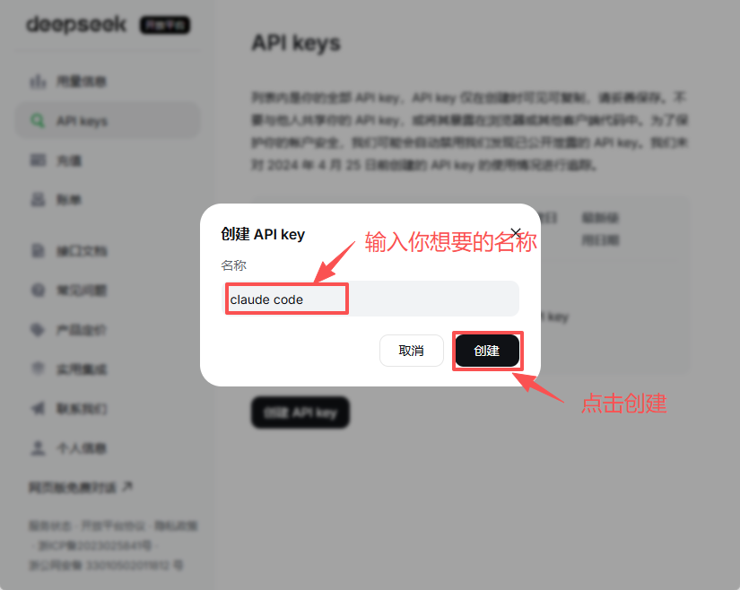
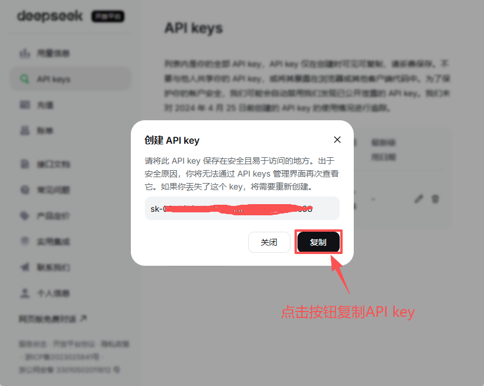

# 🐋 DeepSeek 是什么？

> DeepSeek（深度求索）是一个超级聪明的 AI，特别擅长编程！而且它 **非常便宜**，是我们教程推荐的 AI 模型。

---

## 🤔 DeepSeek 是什么？

DeepSeek 是一家中国 AI 公司（深度求索）开发的 AI 大模型。你可以把它想象成一个 **超级聪明的编程老师**：

- 📝 你用文字告诉它你想做什么
- 💻 它帮你写出完整的代码
- 🐛 你遇到 bug，它帮你找出来并修复
- 💡 你不懂的知识，它用简单的话解释给你听

---

## 🌟 为什么推荐 DeepSeek？

### 1. 💰 超级便宜！

| AI 模型 | 输入价格（每百万 tokens） | 输出价格（每百万 tokens） |
|---------|-------------------|-------------------|
| **DeepSeek V4 Flash** 🐋 | **$0.14**（约 ¥1） | **$0.28**（约 ¥2） |
| **DeepSeek V4 Pro** | **$0.42**（约 ¥3） | **$0.83**（约 ¥6） |
| Claude Sonnet 4.6 | $3.00（约 ¥22） | $15.00（约 ¥108） |
| Claude Opus 4.8 | $5.00（约 ¥36） | $25.00（约 ¥180） |
| GPT-5.4 | $2.50（约 ¥18） | $15.00（约 ¥108） |
| GPT-5.5 | $5.00（约 ¥36） | $30.00（约 ¥216） |

> 🎯 DeepSeek V4 Flash 比 Claude Sonnet 便宜 **20-50 倍**！对学生来说非常友好。

> 💡 价格来源（2026 年 6 月）：[DeepSeek 官方](https://api-docs.deepseek.com/zh-cn/quick_start/pricing)、[Claude 官方](https://platform.claude.com/docs/en/about-claude/pricing)、[OpenAI 官方](https://openai.com/api/pricing/)。价格可能随时间变动，请以官网为准。

### 2. 🧠 编程能力很强

DeepSeek 在编程方面的能力 **和顶级 AI 不相上下**：

- 代码生成质量高
- 支持 Python、JavaScript、HTML/CSS 等主流语言
- 能理解整个项目，不只是单个文件

### 3. 🇨🇳 中文支持好

DeepSeek 是中国团队开发的，**中文理解能力非常好**：
- 你可以用中文和它对话
- 它生成的中文注释和文档很自然
- 适合国内学生使用

### 4. 🔌 容易接入

DeepSeek 使用 **OpenAI 兼容格式** 的 API，这意味着：
- 很多 AI 编程工具都可以直接用它
- 配置非常简单
- 切换模型很方便

---

## 📦 DeepSeek 的模型

DeepSeek 提供了几个不同的模型：

| 模型 | 用途 | 特点 |
|------|------|------|
| `deepseek-v4-flash` | 日常编程 | 速度快、价格低，适合大部分任务 |
| `deepseek-v4-pro` | 复杂推理 | 会"深度思考"，适合难题和大型项目 |

> 💡 **建议先用 `deepseek-v4-flash`**，遇到特别难的问题再切换到 `deepseek-v4-pro`。

---

## 🔗 相关链接

| 名称 | 链接 |
|------|------|
| DeepSeek 官网 | https://platform.deepseek.com/ |
| DeepSeek API 文档 | https://api-docs.deepseek.com/zh-cn/ |
| DeepSeek 聊天界面 | https://chat.deepseek.com/ |

---

## 📝 注册 DeepSeek + 获取 API Key

> API Key 就像一把钥匙，让 AI 编程工具能够使用 DeepSeek 的能力。这一步很重要！

### Step 1：打开 DeepSeek 官网

在浏览器中打开：**https://platform.deepseek.com/**

如果你还没有登录，会自动跳转到登录/注册页面。

### Step 2：注册账号

打开后会直接看到登录/注册页面：



你可以选择以下方式注册（未注册的手机号会自动注册）：

- 📱 用 **手机号** 注册（输入手机号 → 获取验证码 → 登录）
- 💚 用 **微信扫码** 登录

> 💡 **小贴士**：注册完全免费！

> ⚠️ **绑定手机号和邮箱**
>
> 如果你选择了 **微信扫码** 登录，系统可能会让你绑定手机号和邮箱：
>
> **绑定手机号**（如果还没绑定）：
>
> 
>
> 输入你的手机号 → 点击「发送验证码」→ 输入收到的验证码 → 点击「绑定」
>
> **绑定邮箱**（如果还没绑定）：
>
> 
>
> 输入你的邮箱地址 → 点击「发送验证码」→ 输入收到的验证码 → 点击「绑定」
>
> 如果你暂时不想绑定邮箱，也可以点击「稍后再填」，以后再绑定。但建议尽早绑定，方便接收重要通知！

### Step 3：实名认证

DeepSeek 使用 API 需要 **先完成实名认证**。

1. 登录后，点击左侧菜单的 **「充值」**
2. 页面会提示你"未完成实名认证"，点击橙色的 **「去认证」** 按钮



3. 在弹出的实名认证窗口中：
   - 选择 **「个人实名认证」**
   - 填入你的 **真实姓名**
   - 证件类型选择 **「中国大陆二代居民身份证」**
   - 填入你的 **身份证号码**
   - 勾选同意服务协议
   - 点击 **「提交认证」**



> ⚠️ **关于实名认证**
>
> - 需要用你自己的真实信息，或者让爸爸妈妈帮忙填写
> - 未满 14 周岁不能进行线上实名认证，需要家长协助
> - 实名认证是国家法律要求，你的信息会被安全保护

### Step 4：充值

DeepSeek 目前 **没有免费额度**，使用 API 需要先充值。别担心，充值 **¥10 就够用很久了**！

实名认证通过后，回到充值页面：

1. 选择充值金额（建议选 **¥10**）
2. 选择支付方式（**支付宝** 或 **微信支付**）
3. 点击 **「去支付」** 完成支付



> 💡 **充值建议**
>
> - 💰 先充 **¥10** 试试，够用很长时间（几百万个 Token）
> - 🚫 不要一次充值太多，用完再充就行
> - 📱 支付宝和微信支付都可以

### Step 5：进入 API Keys 页面

注册成功后，点击左侧菜单的 **「API Keys」**，进入 API Keys 管理页面：



或者直接访问：**https://platform.deepseek.com/api_keys**

### Step 6：创建你的 API Key

点击 **「创建 API Key」** 后会弹出创建窗口：



1. 在弹窗中给你的 Key 起个名字（比如"我的第一个 Key"）
2. 点击 **「创建」**

创建成功后会弹出这个窗口，显示你的 API Key：



> ⚠️ **非常重要！**
>
> API Key 创建后 **只会显示一次**！
>
> 赶紧点击 **「复制」** 按钮，把它保存好。关掉这个窗口就再也看不到了！
>
> 建议保存到：
> - 📝 一个安全的记事本文件
> - 🔒 密码管理器
> - 🚫 **不要**分享给其他人！

你的 API Key 看起来像这样：`sk-xxxxxxxxxxxxxxxxxxxxxxxxxxxxxxxx`，后面的教程会用到它！

---

## 🎮 在线体验 DeepSeek

> 在配置之前，先在网页上体验一下 DeepSeek 的编程能力吧！

### Step 1：打开 DeepSeek 聊天界面

在浏览器中打开：**https://chat.deepseek.com/**

> 💡 这是 DeepSeek 的免费聊天界面，不需要 API Key 就能用！

### Step 2：试试这些有趣的提示词

你可以复制下面的内容，粘贴到 DeepSeek 的对话框里试试：

#### 🎮 试试 1：让 AI 写游戏

```
请帮我用 HTML + CSS 写一个猜数字游戏：
1. 电脑随机选一个 1-100 之间的数字
2. 玩家输入猜测的数字
3. 每次告诉玩家"大了"还是"小了"
4. 猜对了显示"恭喜你！"和猜了多少次
```

#### 🌈 试试 2：让 AI 做网页

```
请帮我用 HTML + CSS 写一个自我介绍网页：
- 标题：我的个人主页
- 有一段自我介绍
- 有我喜欢的颜色背景
- 加一些好看的样式
```

#### 🧮 试试 3：让 AI 解释代码

```
请用小学生能听懂的话解释什么是变量？
用生活中的例子来说明。
```

### Step 3：观察 DeepSeek 的回答

注意看 DeepSeek 的回答：

1. 📝 **代码格式** — 它会把代码放在代码块里，方便复制
2. 💬 **解释说明** — 它会解释代码的每一部分做什么
3. 🐛 **错误处理** — 它会考虑可能出错的地方

> 🔍 **DeepSeek 思考模式**
>
> 在聊天界面，你可以打开 **「深度思考」** 模式。这个模式下，DeepSeek 会花更多时间"思考"，给出更好的答案。
>
> 适合用在：比较难的问题、复杂的代码。

---

## ❓ 常见问题

### Q：注册需要付费吗？
**注册免费**，但使用 API 需要先充值。建议先充 **¥10** 试试，够用很长时间。

### Q：聊天界面需要付费吗？
普通聊天 **完全免费**！深度思考模式每天也有免费次数。

### Q：API Key 忘记了怎么办？
没关系，回到 API Keys 页面，**重新创建一个新的** 就可以了。API Key 可以创建多个，旧的 Key 如果不需要了，记得点 **「删除」** 把它删掉。

### Q：API Key 泄露了怎么办？
立刻回到 API Keys 页面，**删除那个 Key**，然后创建一个新的。泄露的 Key 别人可以用你的余额！

---

[⬅️ 上一页](#) | [➡️ 下一页：安装 Node.js](./02-nodejs.md)
