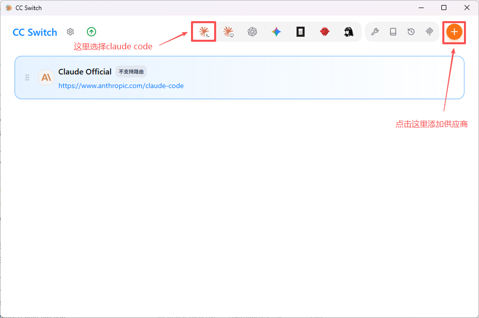
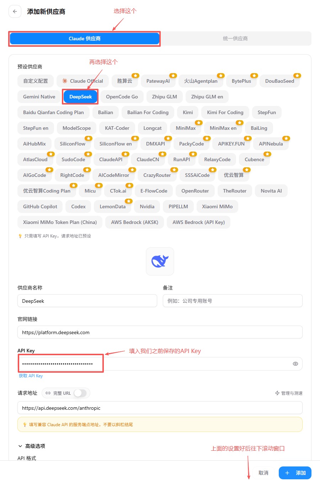
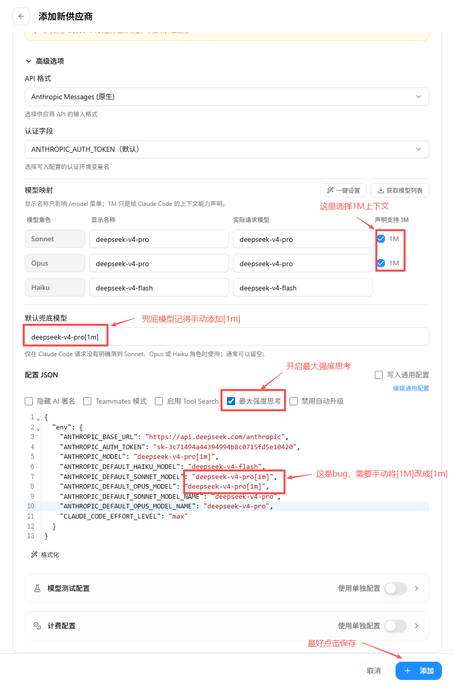
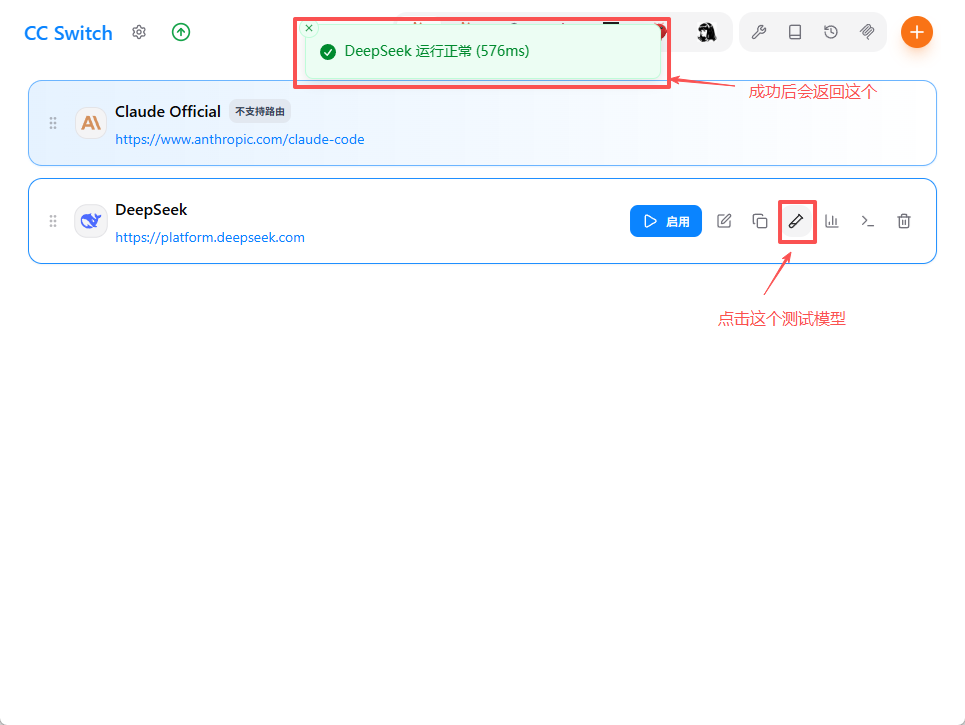
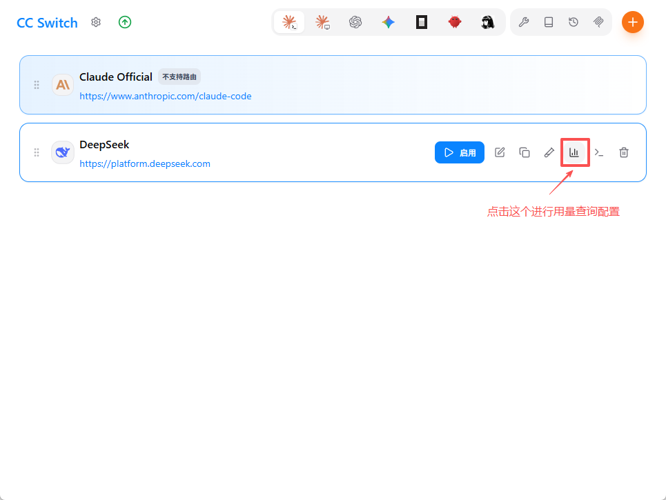
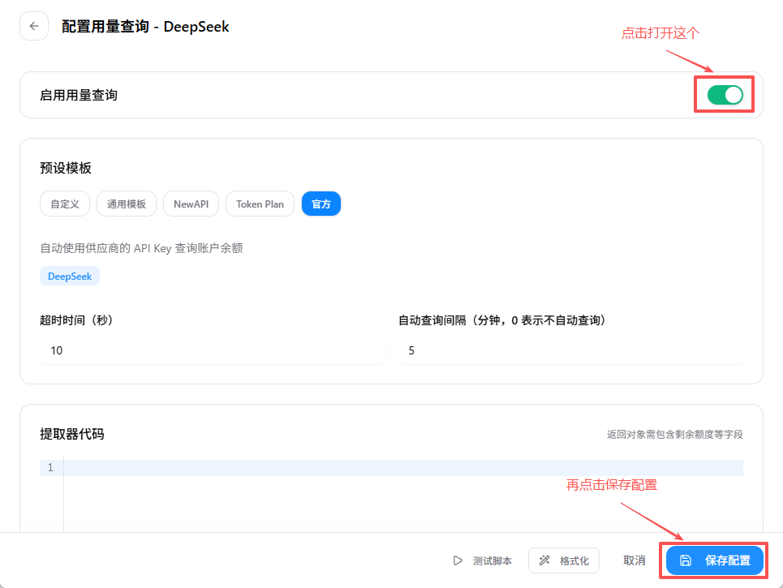
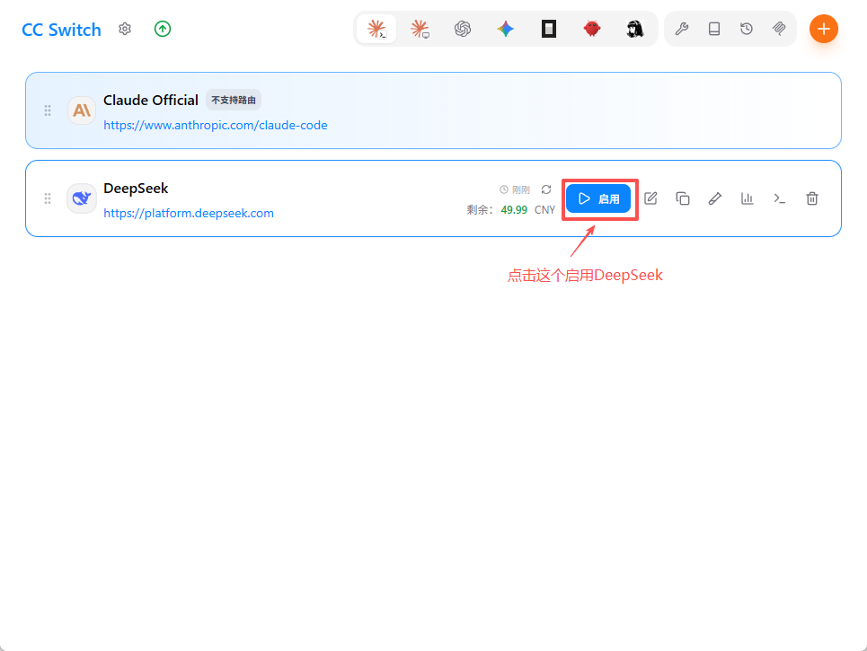
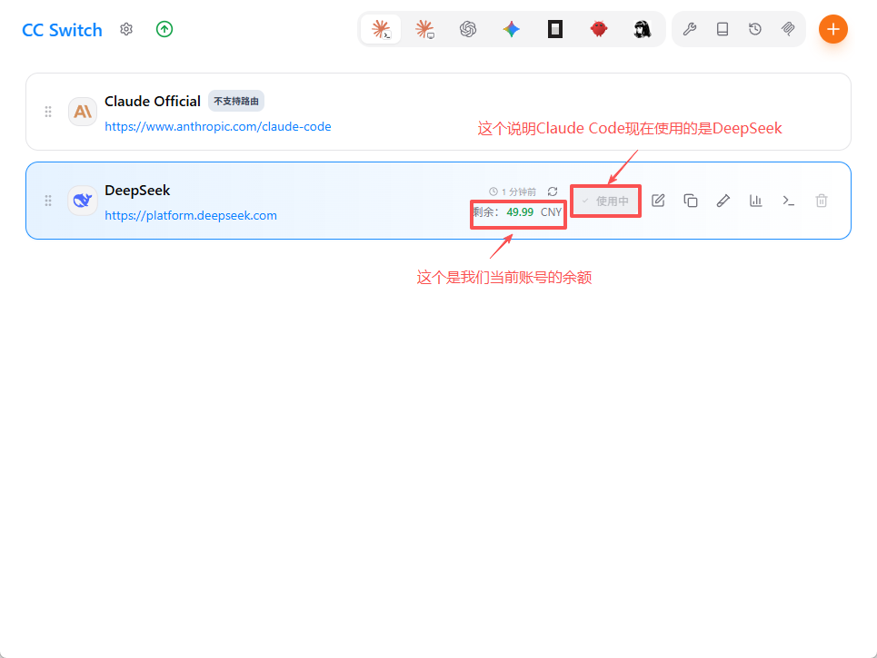
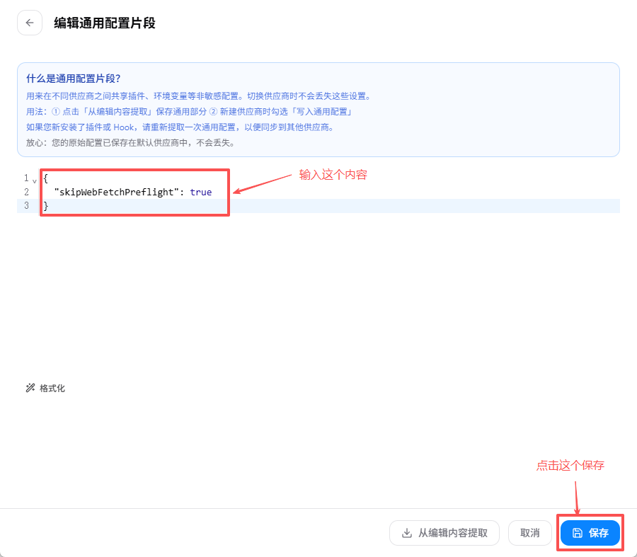
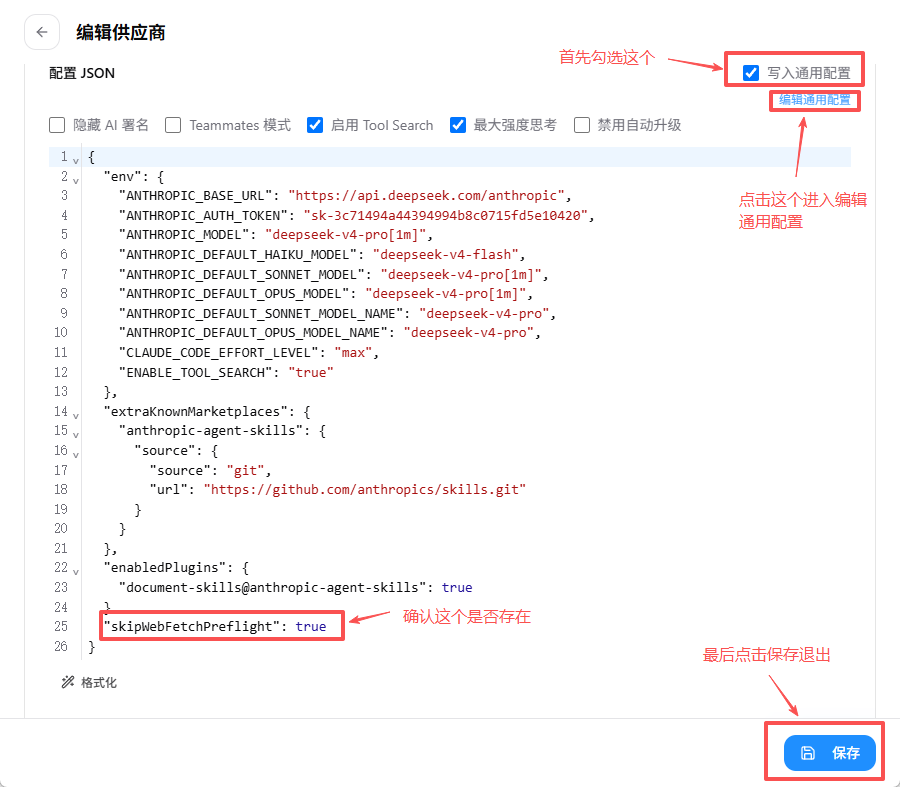

# ⭐ 配置 DeepSeek + Claude Code

> 这是整个教程 **最重要** 的章节！学会这个配置，你就拥有了一个便宜又强大的 AI 编程助手。

---

## 🤔 为什么要配置？

Claude Code 默认使用 **Claude 系列模型**（Anthropic 的 AI，包括 Opus、Sonnet、Haiku 等），默认使用的是 Sonnet，很聪明但 **比较贵**。

> 💡 **Claude 模型家族小科普**
>
> | 模型 | 特点 | 价格 |
> |------|------|------|
> | **Opus** | 🧠 最聪明，解决最复杂的问题 | 💰💰💰 最贵 |
> | **Sonnet** | ⚖️ 聪明又均衡，Claude Code 的默认模型 | 💰💰 中等 |
> | **Haiku** | ⚡ 速度最快，适合简单任务 | 💰 最便宜 |
>
> 就像选书包一样：Opus 是大号书包（装得多但贵），Sonnet 是中号（刚好够用），Haiku 是小号（轻便便宜）。

如果我们把 Claude Code 的"大脑"换成 **DeepSeek**，就能：
- 💰 **省钱** — DeepSeek 比 Claude 便宜 20-50 倍
- 🧠 **同样聪明** — DeepSeek 编程能力很强
- 🇨🇳 **中文更好** — DeepSeek 的中文理解更棒
- 🔌 **切换方便** — 随时可以切换回 Claude 或其他模型

---

## 🌟 配置成功后的效果

配置完成后，你可以这样使用：

```bash
# 启动 Claude Code
claude

# 然后就像平时一样对话！
> 帮我写一个猜数字游戏
```

看起来和之前一模一样，但背后用的是便宜得多的 DeepSeek！

---

## 🛠️ 两种配置方式

我们提供 **两种** 配置方式，从最简单到最灵活：

| 方式 | 难度 | 适合谁 | 说明 |
|------|------|--------|------|
| **方式一：CC Switch** | ⭐ 最简单 | 所有人 | 用图形界面一键配置，推荐！ |
| **方式二：手动配置** | ⭐⭐ 中等 | 有基础的同学 | 编辑 settings.json 或设置环境变量 |

> 💡 **建议**：先试 **方式一（CC Switch）**，最简单！如果 CC Switch 不适合你，再用方式二。

---

## 📋 你需要准备什么

在开始配置之前，确保你已经：

- [ ] ✅ 注册了 DeepSeek 账号并拿到了 API Key（以 `sk-` 开头的字符串）
- [ ] ✅ 安装了 Claude Code

准备好了吗？选一个方式开始吧！

---

## 🌟 方式一：用 CC Switch 配置（推荐！最简单）

> CC Switch 是一个图形界面工具，帮你一键配置 Claude Code + DeepSeek。

### Step 1：安装 CC Switch

> 💡 **版本说明**：本教程以 CC Switch v3.16.1 为例，但建议安装 **最新版本**（GitHub Releases 页面会自动显示最新版）。安装步骤基本相同，直接用最新版就好！

#### Windows 系统

**方式一：安装包（推荐）**

1. 下载安装包（任选一种）：
   - 📦 **指定版本下载**：[CC-Switch-v3.16.1-Windows.msi](https://github.com/farion1231/cc-switch/releases/download/v3.16.1/CC-Switch-v3.16.1-Windows.msi)
   - 🌐 **GitHub 下载**：在 https://github.com/farion1231/cc-switch/releases 找到并下载 **`CC-Switch-vX.X.X-Windows.msi`**
2. 双击下载的 `.msi` 文件
3. 按照安装向导操作，一路"下一步"
4. 安装完成！在桌面或开始菜单找到 CC Switch 打开

**方式二：便携版（免安装）**

1. 下载便携版（任选一种）：
   - 📦 **指定版本下载**：[CC-Switch-v3.16.1-Windows-Portable.zip](https://github.com/farion1231/cc-switch/releases/download/v3.16.1/CC-Switch-v3.16.1-Windows-Portable.zip)
   - 🌐 **GitHub 下载**：在 https://github.com/farion1231/cc-switch/releases 找到并下载 **`CC-Switch-vX.X.X-Windows-Portable.zip`**
2. 解压到任意文件夹
3. 双击 `CC-Switch.exe` 运行

> 💡 便携版适合不想安装或没有管理员权限的情况。

#### macOS 系统

**方式一：Homebrew（推荐）**

如果你已经安装了 Homebrew：

```bash
# 添加 CC Switch 的源
brew tap farion1231/ccswitch

# 安装 CC Switch
brew install --cask cc-switch
```

更新到最新版：

```bash
brew upgrade --cask cc-switch
```

**方式二：手动下载**

1. 下载安装包（任选一种）：
   - 📦 **指定版本下载**：[CC-Switch-v3.16.1-macOS.dmg](https://github.com/farion1231/cc-switch/releases/download/v3.16.1/CC-Switch-v3.16.1-macOS.dmg)
   - 🌐 **GitHub 下载**：在 https://github.com/farion1231/cc-switch/releases 找到并下载 **`CC-Switch-vX.X.X-macOS.dmg`**
2. 双击 `.dmg` 文件
3. 把 CC Switch 拖到"Applications"文件夹
4. 在启动台（Launchpad）找到 CC Switch 打开

> ⚠️ 首次打开时，macOS 可能提示"无法验证开发者"。右键点击应用 → 选择"打开" → 点击"打开"确认即可。

#### Linux 系统

1. 下载对应你的发行版的安装包（任选一种）：

   **指定版本下载**：
   - **Ubuntu/Debian**：[CC-Switch-v3.16.1-Linux-x86_64.deb](https://github.com/farion1231/cc-switch/releases/download/v3.16.1/CC-Switch-v3.16.1-Linux-x86_64.deb)
   - **Fedora/RHEL**：[CC-Switch-v3.16.1-Linux-x86_64.rpm](https://github.com/farion1231/cc-switch/releases/download/v3.16.1/CC-Switch-v3.16.1-Linux-x86_64.rpm)
   - **通用**（免安装）：[CC-Switch-v3.16.1-Linux-x86_64.AppImage](https://github.com/farion1231/cc-switch/releases/download/v3.16.1/CC-Switch-v3.16.1-Linux-x86_64.AppImage)

   **GitHub 下载**：在 https://github.com/farion1231/cc-switch/releases 找到并下载对应文件（`.deb` / `.rpm` / `.AppImage`）
2. 安装：
   ```bash
   # Ubuntu/Debian
   sudo dpkg -i CC-Switch-vX.X.X-Linux.deb

   # Fedora/RHEL
   sudo rpm -i CC-Switch-vX.X.X-Linux.rpm

   # AppImage（免安装）
   chmod +x CC-Switch-vX.X.X-Linux.AppImage
   ./CC-Switch-vX.X.X-Linux.AppImage
   ```

#### 启动 CC Switch

安装完成后，启动 CC Switch：

- **Windows**：开始菜单 → CC Switch
- **macOS**：启动台 → CC Switch
- **Linux**：应用菜单 → CC Switch

第一次启动时，你会看到 CC Switch 的主界面，列出了所有支持的 AI 工具。

---

### Step 2：添加 DeepSeek 供应商

> 💡 **界面提示**：CC Switch 偶尔会更新界面，截图可能与实际页面略有不同，但整体流程是相似的。如果找不到某个按钮，试着找找类似位置的相同文字哦！

#### 2.1 打开供应商管理

1. 启动 CC Switch
2. 在主界面，点击右上角的 **橙色「+」按钮** 添加供应商



> 💡 主界面会显示已添加的供应商卡片（比如默认的 Claude Official）。

#### 2.2 选择 DeepSeek 并填写基础配置

CC Switch 内置了 **50+ API 供应商预设**，你不需要手动填写大部分配置：

1. 在弹出的添加供应商窗口中，先点击顶部的 **「Claude 供应商」** 按钮
2. 在预设列表中找到 **「DeepSeek」**，点击选择它
3. 在 **「API Key」** 输入框中，粘贴你的 DeepSeek API Key



你的 API Key 看起来像这样：`sk-xxxxxxxxxxxxxxxx`

> ⚠️ API Key 是你的密码，不要给别人看！

其他配置项 CC Switch 已经帮你自动填好了：

| 配置项 | 自动填写的内容 |
|--------|--------------|
| 供应商名称 | DeepSeek |
| 请求地址 | `https://api.deepseek.com/anthropic` |

#### 2.3 配置高级选项并保存

基础信息填好后，**下滑页面**，展开「高级选项」区域：



检查并确认以下设置：

1. **模型映射**：确认勾选了 **「1M」** 上下文（这样 Claude Code 可以处理更长的代码）
2. **最大强度思考**：确认 **已勾选**（让 AI 思考更深入）
3. **兜底模型**：确认显示 `deepseek-v4-pro[1m]`

> ⚠️ 以上这些不是默认设置，**需要你手动勾选和填写**，别忘了！

确认无误后，点击右下角的 **「添加」** 按钮保存配置。

#### 2.4 测试连接

保存成功后，回到主界面。现在来测试一下 DeepSeek 能不能正常连接：

1. 找到 **DeepSeek** 卡片
2. 点击卡片上的 **编辑图标（铅笔）** 测试模型



如果看到 **「DeepSeek 运行正常 ✅」** 和响应时间，说明配置成功了！🎉

> 💡 如果测试失败，请检查 API Key 是否正确，或者网络是否能访问 DeepSeek。

#### 2.5 配置用量查询（推荐）

配置用量查询后，CC Switch 会自动显示你的 DeepSeek 账户余额，方便你随时查看。

1. 找到 DeepSeek 卡片，点击 **图表图标（📊）** 进入用量查询配置



2. 在配置页面中：
   - 打开 **「启用用量查询」** 开关
   - 选择 **「官方」** 模板标签页
   - 点击 **「保存配置」**



> 💡 选择「官方」模板后，CC Switch 会自动用你的 API Key 查询余额，不需要额外配置！

#### 2.6 启用 DeepSeek

回到主界面，找到 DeepSeek 卡片，点击 **「启用」** 按钮：



#### 2.7 验证成功 ✅

启用后，确认 DeepSeek 卡片上显示：

- ✅ **「使用中」** 状态 — 说明 Claude Code 现在使用的是 DeepSeek
- ✅ **余额信息** — 显示你账户的剩余金额（如：剩余 49.99 CNY）



看到这些信息，说明你已经配置成功了！🎉🎉🎉

#### 2.8 修复 WebFetch 错误（推荐）

配置好 DeepSeek 后，Claude Code 的网页抓取功能（WebFetch）可能会报错：

```
Unable to verify if domain is safe to fetch.
```

这是因为 Claude Code 默认会通过 Anthropic 服务器检查网址安全性，而国内网络无法访问 Anthropic 服务器。

**解决方法**：在 CC Switch 中添加一个通用配置片段，跳过这个检查：

1. 打开 CC Switch，找到 DeepSeek 供应商卡片，点击 **编辑图标（铅笔）** 进入编辑页面
2. 在编辑页面中，点击下方的 **「编辑通用配置」** 链接



3. 在编辑器中输入以下内容：

```json
{
  "skipWebFetchPreflight": true
}
```

4. 确认选择 **「写入通用配置」**，点击保存



5. 保存后，**重启 Claude Code**（完全退出再重新打开），WebFetch 就可以正常使用了！🎉

> 💡 这个配置会告诉 Claude Code："不用检查网址安全性了，直接抓取"。放心，这不会影响你的电脑安全。

> ⚠️ 如果你在编辑供应商时看到 **「写入通用配置」** 的选项，也可以在那里一并配置。两种方式效果相同。

---

## 📝 方式二：手动配置（settings.json 或环境变量）

> 手动编辑配置文件或设置环境变量来配置 Claude Code + DeepSeek。适合喜欢自己动手的同学 ✏️

> 📖 **参考文档**：[DeepSeek 官方 - 接入 Claude Code](https://api-docs.deepseek.com/zh-cn/quick_start/agent_integrations/claude_code)

### 🔍 需要设置的环境变量

在开始之前，先了解一下每个环境变量的作用 👇

| 环境变量 | 作用 | 填什么 |
|---------|------|--------|
| `ANTHROPIC_AUTH_TOKEN` | 你的 API Key 🔑 | 你的 DeepSeek API Key |
| `ANTHROPIC_BASE_URL` | API 地址 🌐 | `https://api.deepseek.com/anthropic` |
| `ANTHROPIC_MODEL` | 主力模型 🧠 | `deepseek-v4-pro[1m]` |
| `ANTHROPIC_DEFAULT_OPUS_MODEL` | Opus 级别模型 | `deepseek-v4-pro[1m]` |
| `ANTHROPIC_DEFAULT_OPUS_MODEL_NAME` | Opus 模型显示名 | `deepseek-v4-pro` |
| `ANTHROPIC_DEFAULT_SONNET_MODEL` | Sonnet 级别模型 | `deepseek-v4-pro[1m]` |
| `ANTHROPIC_DEFAULT_SONNET_MODEL_NAME` | Sonnet 模型显示名 | `deepseek-v4-pro` |
| `ANTHROPIC_DEFAULT_HAIKU_MODEL` | Haiku 级别模型（轻量）⚡ | `deepseek-v4-flash` |
| `CLAUDE_CODE_EFFORT_LEVEL` | 努力程度 💪 | `max`（全力以赴！） |

> 💡 **小贴士**：
> - `deepseek-v4-pro[1m]` 是 DeepSeek 最强大的模型，`[1m]` 表示支持 **100 万** Token 的超长上下文窗口，用来处理复杂的编程任务
> - `deepseek-v4-flash` 是更轻快、更便宜的模型，用来处理简单的小任务

### 📁 找到配置文件

不管你用什么系统，首先找到 Claude Code 的配置文件：

| 系统 | 路径 |
|------|------|
| **Windows** | `C:\Users\你的用户名\.claude\settings.json` |
| **macOS** | `~/.claude/settings.json` |
| **Linux** | `~/.claude/settings.json` |

> 💡 `~` 代表你的用户主目录。比如在 macOS 上就是 `/Users/你的用户名/`，在 Linux 上是 `/home/你的用户名/`。

---

### macOS / Linux 系统

#### 方法 A：编辑 settings.json（⭐ 推荐）

**Step 1：打开配置文件**

用你喜欢的文本编辑器打开 `~/.claude/settings.json`：

```bash
# 用 VS Code 打开（推荐）
code ~/.claude/settings.json

# 或者用 nano 打开
nano ~/.claude/settings.json
```

> ⚠️ 如果文件不存在，就新建一个。如果文件夹 `.claude` 也不存在，先创建它：`mkdir -p ~/.claude`

**Step 2：写入配置**

如果文件是空的或新建的，把下面的内容**完整复制**进去：

```json
{
  "env": {
    "ANTHROPIC_AUTH_TOKEN": "sk-你的DeepSeek-API-Key",
    "ANTHROPIC_BASE_URL": "https://api.deepseek.com/anthropic",
    "ANTHROPIC_DEFAULT_HAIKU_MODEL": "deepseek-v4-flash",
    "ANTHROPIC_DEFAULT_OPUS_MODEL": "deepseek-v4-pro[1m]",
    "ANTHROPIC_DEFAULT_OPUS_MODEL_NAME": "deepseek-v4-pro",
    "ANTHROPIC_DEFAULT_SONNET_MODEL": "deepseek-v4-pro[1m]",
    "ANTHROPIC_DEFAULT_SONNET_MODEL_NAME": "deepseek-v4-pro",
    "ANTHROPIC_MODEL": "deepseek-v4-pro[1m]",
    "CLAUDE_CODE_EFFORT_LEVEL": "max"
  },
  "skipWebFetchPreflight": true
}
```

> 💡 `"skipWebFetchPreflight": true` 修复了 WebFetch 在国内无法使用的问题。注意它和 `"env"` 平级，不要放在 `"env"` 里面！

如果文件里已经有内容，找到或添加 `"env"` 字段，把上面的环境变量加进去。

**Step 3：替换 API Key**

把 `sk-你的DeepSeek-API-Key` 替换成你的**真实 API Key**。

**Step 4：保存文件**

按 `Ctrl + S`（或 `Command + S`）保存文件。

> 💡 这种方式设置后会**永久生效**，而且只对 Claude Code 有效，不会影响其他程序。

#### 方法 B：在终端中临时设置

打开终端，逐行粘贴执行：

```bash
export ANTHROPIC_BASE_URL="https://api.deepseek.com/anthropic"
export ANTHROPIC_AUTH_TOKEN="sk-你的DeepSeek-API-Key"
export ANTHROPIC_MODEL="deepseek-v4-pro[1m]"
export ANTHROPIC_DEFAULT_OPUS_MODEL="deepseek-v4-pro[1m]"
export ANTHROPIC_DEFAULT_OPUS_MODEL_NAME="deepseek-v4-pro"
export ANTHROPIC_DEFAULT_SONNET_MODEL="deepseek-v4-pro[1m]"
export ANTHROPIC_DEFAULT_SONNET_MODEL_NAME="deepseek-v4-pro"
export ANTHROPIC_DEFAULT_HAIKU_MODEL="deepseek-v4-flash"
export CLAUDE_CODE_EFFORT_LEVEL="max"
```

> ⚠️ **注意**：这种设置只在**当前终端窗口**有效，关闭窗口后就失效了。

#### 方法 C：写入 Shell 配置文件（永久生效）

如果你希望每次打开终端都自动设置好，可以把环境变量写到 Shell 配置文件里。

**Zsh 用户**（macOS 默认）：编辑 `~/.zshrc`

```bash
echo 'export ANTHROPIC_BASE_URL="https://api.deepseek.com/anthropic"' >> ~/.zshrc
echo 'export ANTHROPIC_AUTH_TOKEN="sk-你的DeepSeek-API-Key"' >> ~/.zshrc
echo 'export ANTHROPIC_MODEL="deepseek-v4-pro[1m]"' >> ~/.zshrc
echo 'export ANTHROPIC_DEFAULT_OPUS_MODEL="deepseek-v4-pro[1m]"' >> ~/.zshrc
echo 'export ANTHROPIC_DEFAULT_OPUS_MODEL_NAME="deepseek-v4-pro"' >> ~/.zshrc
echo 'export ANTHROPIC_DEFAULT_SONNET_MODEL="deepseek-v4-pro[1m]"' >> ~/.zshrc
echo 'export ANTHROPIC_DEFAULT_SONNET_MODEL_NAME="deepseek-v4-pro"' >> ~/.zshrc
echo 'export ANTHROPIC_DEFAULT_HAIKU_MODEL="deepseek-v4-flash"' >> ~/.zshrc
echo 'export CLAUDE_CODE_EFFORT_LEVEL="max"' >> ~/.zshrc
source ~/.zshrc
```

**Bash 用户**（部分 Linux 默认）：编辑 `~/.bashrc`

```bash
echo 'export ANTHROPIC_BASE_URL="https://api.deepseek.com/anthropic"' >> ~/.bashrc
echo 'export ANTHROPIC_AUTH_TOKEN="sk-你的DeepSeek-API-Key"' >> ~/.bashrc
echo 'export ANTHROPIC_MODEL="deepseek-v4-pro[1m]"' >> ~/.bashrc
echo 'export ANTHROPIC_DEFAULT_OPUS_MODEL="deepseek-v4-pro[1m]"' >> ~/.bashrc
echo 'export ANTHROPIC_DEFAULT_OPUS_MODEL_NAME="deepseek-v4-pro"' >> ~/.bashrc
echo 'export ANTHROPIC_DEFAULT_SONNET_MODEL="deepseek-v4-pro[1m]"' >> ~/.bashrc
echo 'export ANTHROPIC_DEFAULT_SONNET_MODEL_NAME="deepseek-v4-pro"' >> ~/.bashrc
echo 'export ANTHROPIC_DEFAULT_HAIKU_MODEL="deepseek-v4-flash"' >> ~/.bashrc
echo 'export CLAUDE_CODE_EFFORT_LEVEL="max"' >> ~/.bashrc
source ~/.bashrc
```

> ⚠️ **注意**：这种方式会把 API Key 写在文件里，请确保电脑只有你一个人使用！

---

### Windows 系统

#### 方法 A：编辑 settings.json（⭐ 推荐）

**Step 1：打开配置文件**

配置文件在 `C:\Users\你的用户名\.claude\settings.json`。

用你喜欢的编辑器打开：
- 📝 **记事本**（Windows 自带）
- 📝 **VS Code**（推荐，免费好用）

> ⚠️ `.claude` 可能是隐藏文件夹。你可以在文件管理器的地址栏直接输入路径，或者在 PowerShell 中执行：`code $env:USERPROFILE\.claude\settings.json`

**Step 2：写入配置**

如果文件是空的或新建的，把下面的内容**完整复制**进去：

```json
{
  "env": {
    "ANTHROPIC_AUTH_TOKEN": "sk-你的DeepSeek-API-Key",
    "ANTHROPIC_BASE_URL": "https://api.deepseek.com/anthropic",
    "ANTHROPIC_DEFAULT_HAIKU_MODEL": "deepseek-v4-flash",
    "ANTHROPIC_DEFAULT_OPUS_MODEL": "deepseek-v4-pro[1m]",
    "ANTHROPIC_DEFAULT_OPUS_MODEL_NAME": "deepseek-v4-pro",
    "ANTHROPIC_DEFAULT_SONNET_MODEL": "deepseek-v4-pro[1m]",
    "ANTHROPIC_DEFAULT_SONNET_MODEL_NAME": "deepseek-v4-pro",
    "ANTHROPIC_MODEL": "deepseek-v4-pro[1m]",
    "CLAUDE_CODE_EFFORT_LEVEL": "max"
  },
  "skipWebFetchPreflight": true
}
```

> 💡 `"skipWebFetchPreflight": true` 修复了 WebFetch 在国内无法使用的问题。注意它和 `"env"` 平级，不要放在 `"env"` 里面！

如果文件里已经有内容，找到或添加 `"env"` 字段，把上面的环境变量加进去。

**Step 3：替换 API Key**

把 `sk-你的DeepSeek-API-Key` 替换成你的**真实 API Key**。

**Step 4：保存文件**

按 `Ctrl + S` 保存文件。

> 💡 这种方式设置后会**永久生效**，而且只对 Claude Code 有效。

#### 方法 B：在 PowerShell 中临时设置

打开 PowerShell，逐行粘贴执行：

```powershell
$env:ANTHROPIC_BASE_URL = "https://api.deepseek.com/anthropic"
$env:ANTHROPIC_AUTH_TOKEN = "sk-你的DeepSeek-API-Key"
$env:ANTHROPIC_MODEL = "deepseek-v4-pro[1m]"
$env:ANTHROPIC_DEFAULT_OPUS_MODEL = "deepseek-v4-pro[1m]"
$env:ANTHROPIC_DEFAULT_OPUS_MODEL_NAME = "deepseek-v4-pro"
$env:ANTHROPIC_DEFAULT_SONNET_MODEL = "deepseek-v4-pro[1m]"
$env:ANTHROPIC_DEFAULT_SONNET_MODEL_NAME = "deepseek-v4-pro"
$env:ANTHROPIC_DEFAULT_HAIKU_MODEL = "deepseek-v4-flash"
$env:CLAUDE_CODE_EFFORT_LEVEL = "max"
```

> ⚠️ **注意**：这种设置只在**当前 PowerShell 窗口**有效，关闭窗口后就失效了。

#### 方法 C：在 CMD（命令提示符）中临时设置

打开 CMD，逐行粘贴执行：

```cmd
set ANTHROPIC_BASE_URL=https://api.deepseek.com/anthropic
set ANTHROPIC_AUTH_TOKEN=sk-你的DeepSeek-API-Key
set ANTHROPIC_MODEL=deepseek-v4-pro[1m]
set ANTHROPIC_DEFAULT_OPUS_MODEL=deepseek-v4-pro[1m]
set ANTHROPIC_DEFAULT_OPUS_MODEL_NAME=deepseek-v4-pro
set ANTHROPIC_DEFAULT_SONNET_MODEL=deepseek-v4-pro[1m]
set ANTHROPIC_DEFAULT_SONNET_MODEL_NAME=deepseek-v4-pro
set ANTHROPIC_DEFAULT_HAIKU_MODEL=deepseek-v4-flash
set CLAUDE_CODE_EFFORT_LEVEL=max
```

> ⚠️ **注意**：同样只在**当前 CMD 窗口**有效。

---

### 📊 方法对比

| 方法 | 生效范围 | 持久性 | 安全性 |
|------|---------|--------|--------|
| settings.json 的 env | Claude Code | 永久 ✅ | ⭐⭐⭐ 较安全 |
| 终端临时设置 | 当前终端 | 关闭即失效 | ⭐⭐⭐⭐ 最安全 |
| Shell 配置文件 | 所有终端 | 永久 ✅ | ⭐⭐ API Key 在文件里 |

> 💡 **推荐**：使用 **settings.json 的 env 方式**，既持久又比较安全！

---

## ❓ 常见问题

### Q：配置后还能用回 Claude 模型吗？
**当然可以！** 配置只是 **添加** 了 DeepSeek 作为可选供应商，不会删除 Claude。在 CC Switch 中随时切换供应商。

### Q：DeepSeek 和 Claude 哪个好？
各有优势：
- **DeepSeek**：便宜、中文好、编程强
- **Claude**：推理能力最强、功能最全

建议日常用 DeepSeek，遇到特别难的问题切换到 Claude。

### Q：settings.json 格式错误怎么办？

检查以下几点：
- 每个键值对后面有没有多余的逗号 `,`
- 有没有缺少引号 `"`
- 最后一个元素后面**不能有逗号**

> 💡 可以用 JSON 验证工具检查：https://jsonlint.com/

### Q：环境变量设置后不生效？

1. **关闭终端，重新打开** 再试一次
2. 检查是否拼写正确（注意大小写，变量名全是**大写字母**）
3. 确认 API Key 没有多余的空格或引号
4. 如果用的是 settings.json，检查 JSON 格式是否正确（逗号、括号别漏了）

### Q：`ANTHROPIC_BASE_URL` 末尾的 `/anthropic` 可以省略吗？

❌ **不可以！** 这个 `/anthropic` 是 DeepSeek 的 Anthropic 兼容接口路径，少了它 Claude Code 就找不到 API 了。

---

[⬅️ 上一页：安装 Claude Code](./03-claude-code.md) | [➡️ 下一页：学会基本用法](./05-basics.md)
